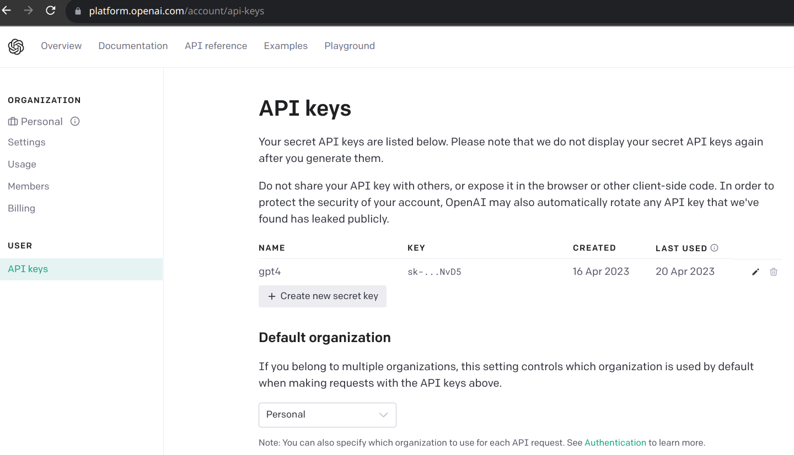

# GPT-4 Command Executor

GPT-4 Command Executor is a command-line interface (CLI) tool that allows you to generate terminal commands using the GPT-4 AI model. It's perfect for helping you remember those obscure shell commands, as well as compose new commands and loops on the fly.

## ⚠️ Warning

Executing commands generated by an AI model may lead to unexpected results and security risks. Always review and approve the commands before allowing them to execute.

## Features

- Interact with OpenAI's GPT-4 model to generate terminal commands
- Execute commands locally using the Python `subprocess` library
- Store API keys securely using environment variables and `python-dotenv`

## Requirements

- Python 3.6 or higher
- An OpenAI API key (register at https://beta.openai.com/signup/)
- Create new secret key (https://platform.openai.com/account/api-keys)
- 

## Installation
1. Clone the repository
2. `pip install --user .`
3. `export PATH=$PATH:$HOME/.local/bin`
4. `export OPENAI_API_KEY=<your API key>`

## Usage
```
q '?? <command request>'
```

## Example

The script will prompt you for a command request, and then use GPT-4 to generate and execute a potential terminal command based on your input.

Please ensure you understand and accept all potential risks associated with executing AI-generated commands. Always review and approve the commands before executing them to avoid unintended results or security-related issues.

Here's an example of the script in action:

```
    ~  q '?? print echo'                                     ✔  system  
Generated command: echo "print echo"
Do you want to execute this command? (y/n): n
Sorry, I couldn't generate a command for that request.
```

```
    ~  q '?? remove whole system'                            ✔  system  
Generated command 'rm -rf /*' is not safe. Skipping execution.
Sorry, I couldn't generate a command for that request.
```

```
    ~  q '?? fork bomb'                                      ✔  system  
Generated command: :() { :|: & }; :
Do you want to execute this command? (y/n): 
```

```
    ~  q '?? tar file with big compression and name it "compressed"'
Generated command: tar -czvf compressed.tar.gz *
Do you want to execute this command? (y/n): 
```

```
    ~  q '?? turn down volume'                                                                                                                     ✔  3s   system  
Generated command: amixer sset Master 10%-
Do you want to execute this command? (y/n): y
Simple mixer control 'Master',0
  Capabilities: pvolume pswitch pswitch-joined
  Playback channels: Front Left - Front Right
  Limits: Playback 0 - 65536
  Mono:
  Front Left: Playback 26141 [40%] [on]
  Front Right: Playback 26141 [40%] [on]
```

```
    ~  q '?? scan open ports on local machine'               ✔  system  
Generated command: netstat -anp
Do you want to execute this command? (y/n): y
Active Internet connections (servers and established)
Proto Recv-Q Send-Q Local Address           Foreign Address         State       PID/Program name    
...
```

```
    ~  q '?? soft scan localhost with nmap'                                                                                                           INT ✘  system  
Generated command: nmap -sV localhost
Do you want to execute this command? (y/n): y
Starting Nmap 7.93 ( https://nmap.org ) at 2023-04-20 23:36 CEST
Nmap scan report for localhost (127.0.0.1)
Host is up (0.000066s latency).
Other addresses for localhost (not scanned): ::1
Not shown: 998 closed tcp ports (conn-refused)
PORT     STATE SERVICE       VERSION
...
```

```
    ~  q '?? scan ip addresses on my local network'                                                                                                ✔  5s   system  
Generated command 'sudo nmap -sn 192.168.0.0/24' is not safe. Skipping execution.
Sorry, I couldn't generate a command for that request.
```

## Contributing
Contributions are welcome! Please feel free to submit a Pull Request or create an Issue if you encounter any problems or have suggestions for improvements.

## License
This project is licensed under the MIT License. See the LICENSE file for more information.